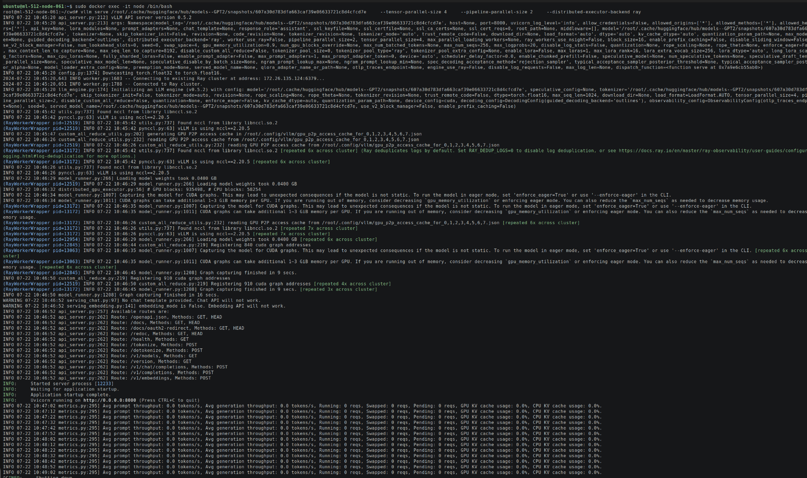
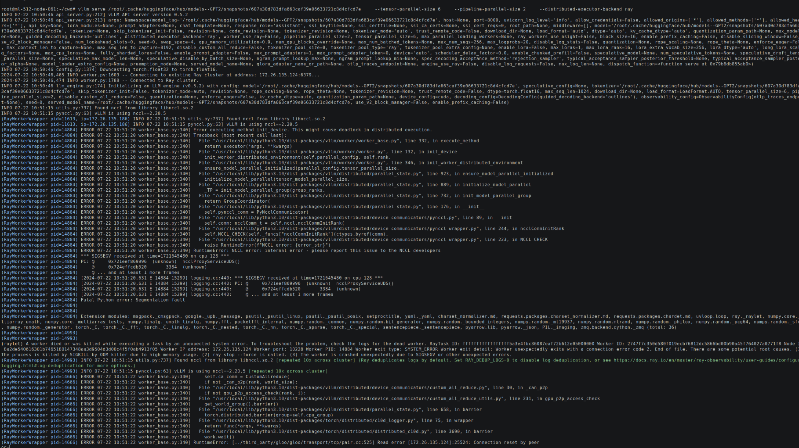
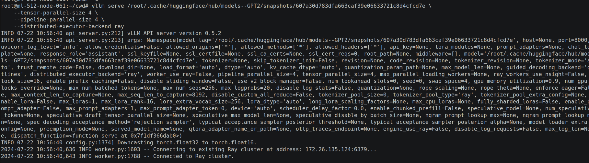

# Setup for multi-node llama-3

Hop onto cluster
```bash
ssh -i ~/.ssh/ml.pem -F ~/.ssh/config.d/config.ml-512 ml-512-node-061
ssh -i ~/.ssh/ml.pem -F ~/.ssh/config.d/config.ml-512 ml-512-node-062
ssh -i ~/.ssh/ml.pem -F ~/.ssh/config.d/config.ml-512 ml-512-node-063
ssh -i ~/.ssh/ml.pem -F ~/.ssh/config.d/config.ml-512 ml-512-node-064
```


## Multi-node Inference and Serving


NOTE:
**The head node GPUs cannot be used for inference in following process.**
Error: `Ray does not allocate any GPUs on the driver node. Consider adjusting the Ray placement group or running the driver on a GPU node.`
Fix is to launch an extra worker node.

## Preparation


Store model weights and setup/execution scripts to run on all nodes in storage accessible by all nodes 

`.cache` dir shared across nodes : contains cached huggingface model weights
```bash
cd /home/ubuntu/ml-1cc/eole
mkdir .cache
cd .cache
mkdir huggingface vllm
```

Download models of interest to shared directory
```bash
export HF_HOME=/home/ubuntu/ml-1cc/eole/.cache/huggingface
huggingface-cli download GPT2
#huggingface-cli download Meta/Llama-3-70B-Instruct

# Note model snapshot path for serving command later
# /home/ubuntu/ml-1cc/eole/.cache/huggingface/hub/models--GPT2/snapshots/607a30d783dfa663caf39e06633721c8d4cfcd7e
```

`cwd` dir shared across nodes : contains scripts to be run on each node
```bash
cd /home/ubuntu/ml-1cc/eole
mkdir .cwd
cd .cwd
# Write test_worker.sh
# Write test_head.sh
```

Build Docker image on each node (assumes Dockerfile.base is accessible at `/home/ubuntu/ml-1cc/eole`).
TODO: add caching mechanism shared accross node for building once and using on all nodes
```bash
cd ~/ml-1cc/eole
docker build -t vllm-base .
```


## Execution

Docker run commands below.

head node:
```bash
DOCKER_IMAGE=vllm-base:latest
SCRIPTS_DIR=/home/ubuntu/ml-1cc/eole/cwd
CACHE_DIR=/home/ubuntu/ml-1cc/eole/.cache
docker run \
  --privileged \
  --uts=host \
  --network host \
  --name node \
  --ipc host \
  --gpus all \
  -e UCX_TLS=self,shm,tcp \
  -e NCCL_P2P_LEVEL=NVL \
  -e NCCL_NET_GDR_LEVEL=PIX \
  -e NCCL_IB_HCA='mlx5_1,mlx5_2,mlx5_3,mlx5_4,mlx5_5,mlx5_6,mlx5_7,mlx5_8' \
  -e NCCL_IB_PCI_RELAXED_ORDERING=1 \
  -v ${CACHE_DIR}:/root/.cache/ \
  -v ${SCRIPTS_DIR}:/root/cwd \
  ${DOCKER_IMAGE} /bin/bash -c "ray start --head --port=6379 --block"
```
*Copy the Local node IP: eg `172.26.135.124` for the next command*

worker node:
```bash
DOCKER_IMAGE=vllm-base:latest
SCRIPTS_DIR=/home/ubuntu/ml-1cc/eole/cwd
CACHE_DIR=/home/ubuntu/ml-1cc/eole/.cache
HEAD_IP=172.26.135.124
docker run \
  --privileged \
  --uts=host \
  --network host \
  --name node \
  --ipc host \
  --gpus all \
  -e UCX_TLS=self,shm,tcp \
  -e NCCL_P2P_LEVEL=NVL \
  -e NCCL_NET_GDR_LEVEL=PIX \
  -e NCCL_IB_HCA='mlx5_1,mlx5_2,mlx5_3,mlx5_4,mlx5_5,mlx5_6,mlx5_7,mlx5_8' \
  -e NCCL_IB_PCI_RELAXED_ORDERING=1 \
  -v ${CACHE_DIR}:/root/.cache/ \
  -v ${SCRIPTS_DIR}:/root/cwd \
  ${DOCKER_IMAGE} /bin/bash -c "ray start --address=${HEAD_IP}:6379 --block"
```

Serving command on head node:
*Options ignored for now: --load_format dummy --disable-log-requests*
```bash
sudo docker exec -it node /bin/bash
vllm serve /root/.cache/huggingface/hub/models--GPT2/snapshots/607a30d783dfa663caf39e06633721c8d4cfcd7e \
    --tensor-parallel-size 4 \
    --pipeline-parallel-size 2 \
    --distributed-executor-backend ray
```
Success:



Other attempt with larger `tensor-parallel-size 6 --pipeline-parallel-size 2`:
```bash
sudo docker exec -it node /bin/bash
vllm serve /root/.cache/huggingface/hub/models--GPT2/snapshots/607a30d783dfa663caf39e06633721c8d4cfcd7e \
    --tensor-parallel-size 6 \
    --pipeline-parallel-size 2 \
    --distributed-executor-backend ray
```
Error:



Other attempt with larger `tensor-parallel-size 4 --pipeline-parallel-size 4`:
```bash
sudo docker exec -it node /bin/bash
vllm serve /root/.cache/huggingface/hub/models--GPT2/snapshots/607a30d783dfa663caf39e06633721c8d4cfcd7e \
    --tensor-parallel-size 4 \
    --pipeline-parallel-size 4 \
    --distributed-executor-backend ray
```
Hangs at this point:
